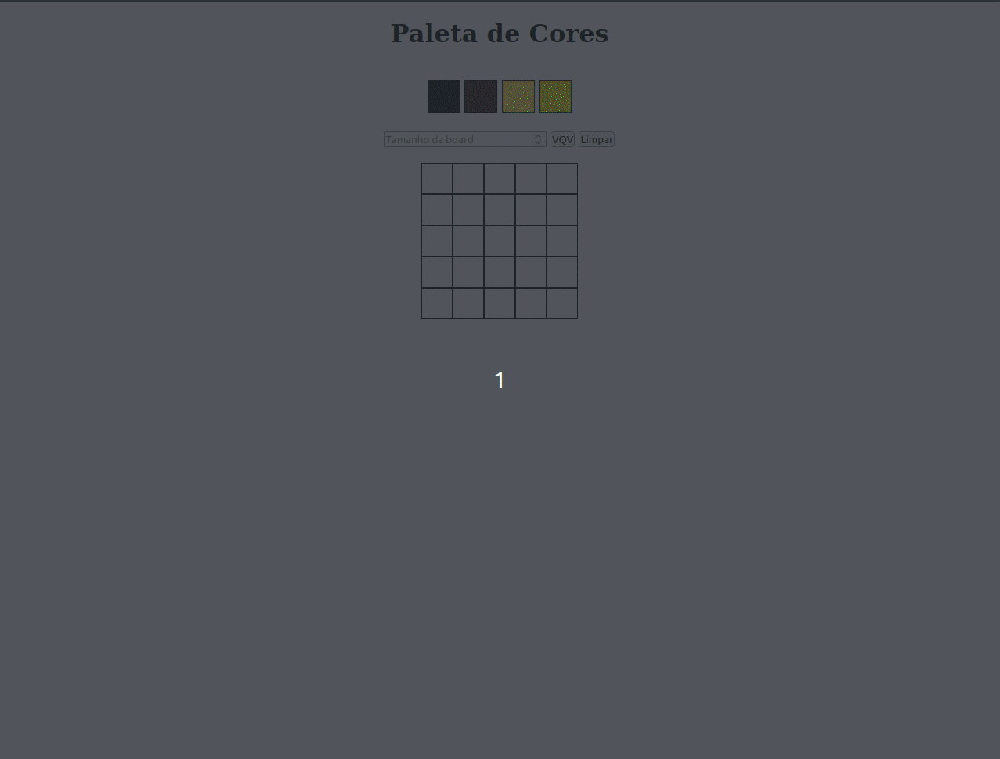
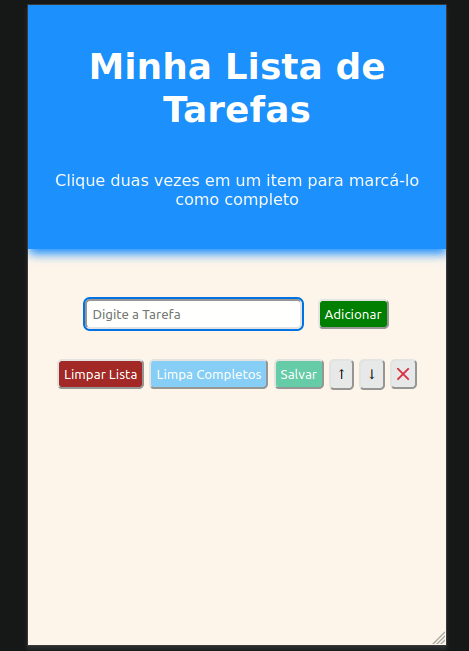
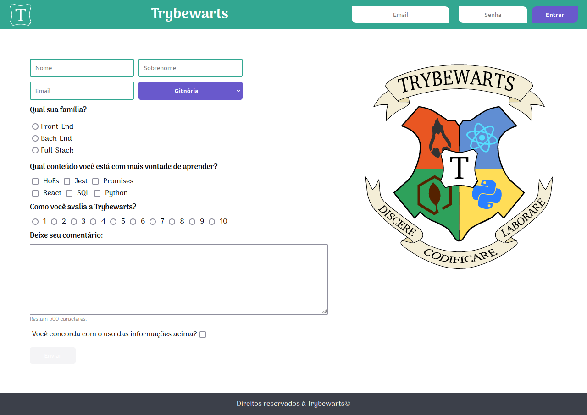

# Repositorio contendo todos os meu projetos 🚧

Criei esse repositório para deixar de forma mais organizada todos os projetos que vou desenvolvendo durante toda minha trajetória, para a pratica pessoal, ideias e testes com as tecnologias que venho aprendendo ao longo da minha jornada.

# Projeto passando conhecimento 📖

Me dediquei a esse projeto com o intuito de colocar em prática conhecimentos adquiridos durante a minha caminhada no aprendizado de programação, apliquei carinho esforço, dedicação, um pouco de **HTML** e **CSS** nesse projeto e na ordem em que eu acredito ser a melhor no aprendizado dessa tecnologia. Obrigado por visitar o meu perfil❗

  

- [Projeto Passando conhecimento](https://guilherme-artigas.github.io/Projeto-Passando-Conhecimento/)

# Projeto sobre Irina Blok 📱

Desenvolvi esse projeto com muito carinho e preocupação em manter um código limpo e bem organizado, para facilitar a manutenção caso necessário, ele é totalmente responsivo a qualquer tamanho de tela, os links por enquanto não redirecionam, porém é algo que vou ajustar ao longo do curso, apliquei conhecimentos de semântica em **HTML** e psicologia de cores para manter uma harmonia ao **CSS**, fontes personalizadas e os links contidos nos textos estilizados com a preocupação de ficarem bem nítidos ao visitante

Esse projeto faz parte de um conjunto de módulos do curso de **HTML** e **CSS** do [curso em vídeo](https://www.cursoemvideo.com/).

  

- [Projeto Sobre Irina Blok](https://guilherme-artigas.github.io/Projeto-Sobre-IrinaBlok/)

# Projeto Pixels Art 🎨

**Pixels** Art foi um dos meus primeiros projetos como aluno da [Trybe](https://www.betrybe.com/), ele foi desenvolvido ao final de um dos blocos do curso, nesse bloco em específico eu aprendi a importância do **DOM** para a web como um todo, trabalhei muito com os as tags criadas dinamicamente através do **Javascript**, aprendi sobre **Eventos**, **WebStorage** e apliquei todos esses conceitos para desenvolver esse projeto.
 
**Pixels Art** É uma página simples que o usuário pode escolher uma entre 4 cores, sendo 3 delas geradas de forma aleatória a cada carregamento da página, e pintar os quadrados em branco, também é possível escolher a quantidade de quadrados para pintar e limpar a board caso queira! É um projeto simples, mas me trouxe muitos conhecimentos!! Obrigado por visitar...

  

- [Pixels Art](https://guilherme-artigas.github.io/projetos/Pixels-Art/)

# Projeto Lista de Tarefas 📝

**Lista de Tarefas** foi um projeto bonûs desenvolvido durante o curso da Trybe, nele eu apliquei conhecimentos sobre manipulação do **DOM** através do Javascript, Salvar informações em **WebStorage** para que caso o usuário feche a página contendo alguma informação, quando voltar essas informações estejam salvas...
 
Com o **Lista de tarefas** É possível adicionar novas tarefas, marcar as que já foram concluídas, excluir da lista apenas as que foram concluídas, limpar toda a lista, salvar e remover apenas as selecionadas, para marcar uma tarefa como concluída basta apenas dar um duplo click!

  

- [Lista de Tarefas](https://guilherme-artigas.github.io/projetos/Lista-Tarefas/)

# Projeto TrybeWarts 🔮

**Trybewarts** foi o meu primeiro projeto desenvolvido de forma colaborativa com o meu colega de turma [Guilherme Machado](https://www.linkedin.com/in/machadodev/), nesse projeto trabalhamos juntos para desenvolver lógicas com **JavaScript**, **Formulários em HTML**, Algumas Bibliotecas JS e Frameworks CSS como o **Maravilhoso Flebox** é um conceito importantíssimo que é a preocupação em desenvolver de forma responsiva usando a técnica mobile-first...
 
### Algumas características desse projeto são:
 
- Validação nos campos de e-mail e senha. (A mensagem de bem-vindo só aparece caso o e-mail seja tryber@teste.com e a senha 123456);
- Campo de texto com contagem dinâmica de caracteres restantes;
- Botão de envio de informações só é habilitado caso o usuário aceite o uso dessas informações;
- Após o preenchimento do formulário é exibido todas as informações que foram preenchidas.

  

- [TrybeWarts](https://guilherme-artigas.github.io/projetos/Trybewarts/)

- [Carrinho de Compras](https://guilherme-artigas.github.io/projetos/Carrinho-de-Compras/)
